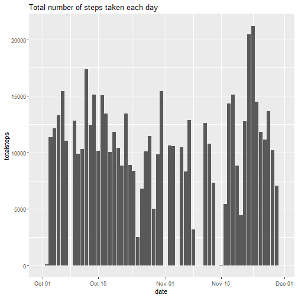
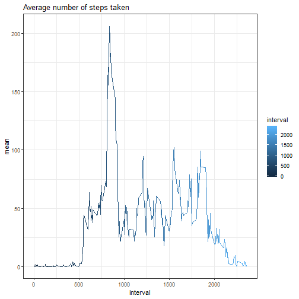
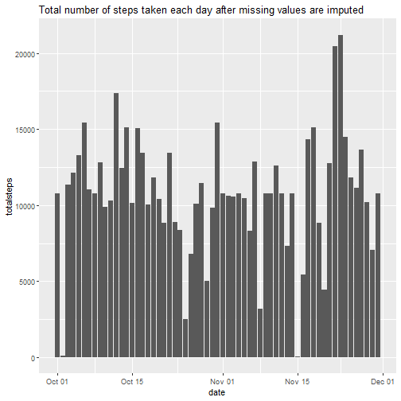
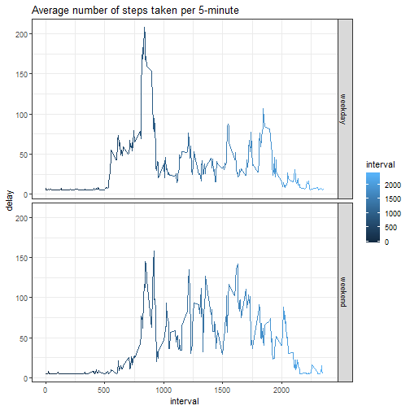

# 1.reading activity.csv

```r
activity <- read.csv("activity.csv",colClasses = c("numeric","Date","numeric"))
head(activity)
```

```
##   steps       date interval
## 1    NA 2012-10-01        0
## 2    NA 2012-10-01        5
## 3    NA 2012-10-01       10
## 4    NA 2012-10-01       15
## 5    NA 2012-10-01       20
## 6    NA 2012-10-01       25
```


#total step taken each day


```r
library(tidyverse)
step_per_day <- group_by(activity,date)
(total_step_per_day <- summarise(step_per_day,totalsteps=sum(steps,na.rm=TRUE)))
```

```
## # A tibble: 61 x 2
##    date       totalsteps
##    <date>          <dbl>
##  1 2012-10-01          0
##  2 2012-10-02        126
##  3 2012-10-03      11352
##  4 2012-10-04      12116
##  5 2012-10-05      13294
##  6 2012-10-06      15420
##  7 2012-10-07      11015
##  8 2012-10-08          0
##  9 2012-10-09      12811
## 10 2012-10-10       9900
## # ... with 51 more rows
```

#2.plot histogram(total step taken each day)

```r
ggplot(data=total_step_per_day)+geom_histogram(aes(x=date,y=totalsteps),stat = "identity")+ggtitle(label ="Total number of steps taken each day")
```

```
## Warning: Ignoring unknown parameters: binwidth, bins, pad
```




#summary information about steps

```r
summary(step_per_day)
```

```
##      steps             date               interval     
##  Min.   :  0.00   Min.   :2012-10-01   Min.   :   0.0  
##  1st Qu.:  0.00   1st Qu.:2012-10-16   1st Qu.: 588.8  
##  Median :  0.00   Median :2012-10-31   Median :1177.5  
##  Mean   : 37.38   Mean   :2012-10-31   Mean   :1177.5  
##  3rd Qu.: 12.00   3rd Qu.:2012-11-15   3rd Qu.:1766.2  
##  Max.   :806.00   Max.   :2012-11-30   Max.   :2355.0  
##  NA's   :2304
```

#3.mean and median of steps


```r
(mean_median <- summarise(step_per_day,mean=mean(steps,na.rm = TRUE),median=median(steps,na.rm=TRUE)))
```

```
## # A tibble: 61 x 3
##    date          mean median
##    <date>       <dbl>  <dbl>
##  1 2012-10-01 NaN         NA
##  2 2012-10-02   0.438      0
##  3 2012-10-03  39.4        0
##  4 2012-10-04  42.1        0
##  5 2012-10-05  46.2        0
##  6 2012-10-06  53.5        0
##  7 2012-10-07  38.2        0
##  8 2012-10-08 NaN         NA
##  9 2012-10-09  44.5        0
## 10 2012-10-10  34.4        0
## # ... with 51 more rows
```


#4. time series(the average number of steps taken)

```r
interval_group <- group_by(activity,interval)
output <- summarise(interval_group,mean=mean(steps,na.rm=TRUE))
ggplot(data=output)+geom_line(aes(x=interval,y=mean,colour=interval))+theme_bw()+ggtitle(label="Average number of steps taken")
```




#5. max value in time series

```r
which.max(step_per_day$steps)
```

```
## [1] 16492
```

```r
step_per_day[16492,]
```

```
## # A tibble: 1 x 3
## # Groups:   date [1]
##   steps date       interval
##   <dbl> <date>        <dbl>
## 1   806 2012-11-27      615
```

#rows with NA

```r
sum(is.na(activity))
```

```
## [1] 2304
```

#mean of steps (to impute NA)

```r
(value <-mean(activity$steps,na.rm=T))
```

```
## [1] 37.3826
```

#6. replace the NA with mean value of steps

```r
step_per_day[is.na(step_per_day)] <- value
```

#total step taken each day after imputing


```r
library(tidyverse)
step_per_day2 <- group_by(step_per_day,date)
total_step_per_day2 <- summarise(step_per_day2,totalsteps=sum(steps,na.rm=TRUE))
```

#7. plot histogram after imputing

```r
ggplot(data=total_step_per_day2)+geom_histogram(aes(x=date,y=totalsteps),stat = "identity")+ggtitle(label ="Total number of steps taken each day after missing values are imputed")
```

```
## Warning: Ignoring unknown parameters: binwidth, bins, pad
```




#create two variable for creating weekday and weekend

```r
weekdays <- c("Monday","Tuesday","Wednesday","Thursday","Friday")
weekend <- c("Saturday","Sunday")
```

#adding column to data and transforming it to factor

```r
activity2 <- mutate(activity,week =weekdays(activity$date))
activity2$week[activity2$week %in% weekdays] <- "weekday"
activity2$week[activity2$week %in% weekend] <- "weekend"
activity2$week <- as.factor(activity2$week)
head(activity2)
```

```
##   steps       date interval    week
## 1    NA 2012-10-01        0 weekday
## 2    NA 2012-10-01        5 weekday
## 3    NA 2012-10-01       10 weekday
## 4    NA 2012-10-01       15 weekday
## 5    NA 2012-10-01       20 weekday
## 6    NA 2012-10-01       25 weekday
```

#impute data (repeated)

```r
activity2[is.na(activity2)] <- value
```

#8. comparing total steps across weekday and weekend

```r
by <- group_by(activity2,week,interval)
output <- summarise(by,delay=mean(steps,na.rm=TRUE))
ggplot(data=output)+geom_line(aes(x=interval,y=delay,colour=interval))+facet_grid(week~.)+theme_bw()+ggtitle(label = "Average number of steps taken per 5-minute")
```




